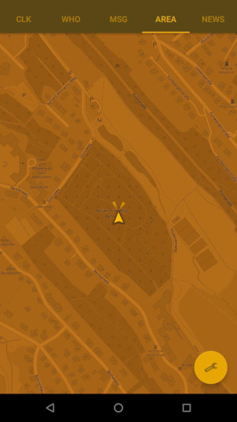

# Pilp Com

I try to build a Pip-Boy for real live without game interaction. Maybe it 
is an idea for cosplay or role play.

Features:

- display day, time, vibration and magnet detector (and power as HP, battery -10 celsius temperature)
- list contacts (option to send sms or make a call)
- list received sms and other messages with special rights
- get location and show a map
- a single text only rss feed reader and internet radio player
- press on clock (the actual time) to set URLs (Radio and RSS), map zoom and message limit

You can switch through the function views with android bluetooth keyboard via cursor keys or:

- **K** Clk (clock)
- **I** Who (contacts)
- **J** Msg (SMS and other messages)
- **M** Area (OSM map)
- **O** News (RSS reader and internet radio)

Cursor key:

- left/right to switch through "functions"
- up/down to scroll or focus contact, message, news or radio sation "buttons"

Enter: to select a contact or a radio station

Tab: to switch focus on cancel or ok button (contact function for doing sms or call)

Names and design is different to the original app and interface. I do not want any copyright trouble.

## Bug!!!

The app activitys are running in background. Use app details to stop the app!!

## Todo ?

- tool to build sms with default text blocks via an easy bluetooth control keyboard device
- alternative: bluetooth 2.0 UART to control the app

## Get the App

You can get a signed APK (4.4.4+) from [here](https://raw.githubusercontent.com/no-go/PilpCom/master/app/release/de.digisocken.pilp_com.apk)

## Screenshots (old)

Date, time, vibration detection.

Contacts are selectable to send sms or do a call.

Try to list the last messages. Non SMS messages needs special notifications access.

Display a OSM map in green. It tries to get GPS location, orientation and speed. Set the zoom factor in the preferences.

Radio displays a RSS feed. You can set the url in preferences. Four internet radio stations are selectable.

Language Igbo: green layout.
Language Hausa: blue layout.
