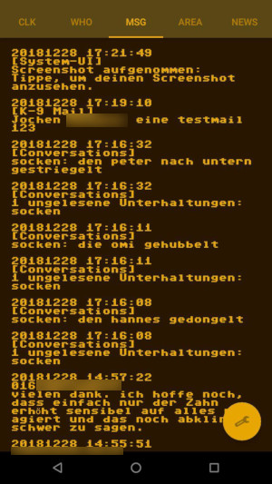

# Pilp Com

I try to build a Pip-Boy for real live without game interaction. Maybe it 
is an idea for cosplay or role play.

Features:

- display day, time, vibration and magnet detector (and power as HP, battery -10 celsius temperature)
- list contacts (option to send sms or make a call)
- list received sms and other messages with special rights
- get location and show a map
- a single text only rss feed reader and internet radio player
- press on clock (the actual time) to set URLs (Radio and RSS), map zoom, message limit, App width, left- and top padding
- alternative: bluetooth 2.0 UART to control the app

Names and design is different to the original app and interface. I do not want any copyright trouble.

You can switch through the function views with android bluetooth keyboard via cursor keys or:

- **K** Clk (clock)
- **I** Who (contacts)
- **J** Msg (SMS and other messages)
- **M** Area (OSM map)
- **O** News (RSS reader and internet radio)

Cursor key:

- left/right to switch through "functions"
- up/down to scroll or focus contact, message, news or radio staion "buttons"

Enter: to select a contact or a radio station

Tab: to switch focus on cancel or ok button (contact function for doing sms or call)

## bluetooth 2.0 UART

Use [bluetooth 2 UART App](https://raw.githubusercontent.com/no-go/Bluetooth-2-UART/master/Application/release/de.digisocken.bluetooth2uart.apk)
and select your old bluetooth 2 uart device and pair it. This app forward the bytes as string
to the Pilp Com App. Pilp Com simulate UART chars u,d,l,r as up,down,left,right and t as TAB and s as ENTER (select).
The k,i,j,m,o keys are simulated, too.

### Firmware

I use an Arduino mini clone (WAVGAT) for this and a simple Bluetooth 2.1 UART module.
It runs software serial on PIN 10 and 11 conneted to the bluetooth UART pins.
The bluetooth link LED is my orange power LED.

I use 2 buttons: the TAB button sets PIN 3 to ground (t). The SELECT button sets PIN 4 to ground (s).
I use a 25k potentiometer as function switch (0 .. 3.7V): it is connected to A1. It sends
continusly the selected function via a UART char (k,i,j,m,o).
I use a rotation encoder (A to PIN 5, middle to ground, B to PIN 7) for the up (u) and down (d)
UART signal.

### Firmware 2

I add a 3.3V, GND and i2c Bus plug for additional use (without Smartphone or bluetooth).
With this 2nd firmware you can add an i2c oled Display SSD1306 and i2c fm radio RDA5807M to
the PilpCom. The additional control for the radio is:

- poti as volume control
- buttons for selecting preset radio stations
- rotation encode for non automatic tune freq seek
- if you set volume to the lowest level: buttons can be used to set hour/minutes of the clock

Display: battery powerbar, rds radio station, freqency, clock, volume level, station signal

## Bug!!!

The app activitys are running in background. Use app details to stop the app!!

## Todo ?

- tool to build sms with default text blocks via an easy bluetooth control keyboard device
- better display selected buttons CANCEL and OK

## Get the App

You can get a signed APK (4.4.4+) from [here](https://raw.githubusercontent.com/no-go/PilpCom/master/app/release/de.digisocken.pilp_com.apk)

## Screenshots (old)

Date, time, vibration detection.

Contacts are selectable to send sms or do a call.

Try to list the last messages. Non SMS messages needs special notifications access.

Display a OSM map in green. It tries to get GPS location, orientation and speed. Set the zoom factor in the preferences.

Radio displays a RSS feed. You can set the url in preferences. Four internet radio stations are selectable.

Language Igbo: green layout.

Language Hausa: blue layout.
